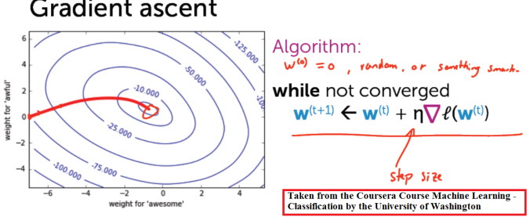

# Coursera Cerfiications / Courses Completed
 

# Table of Contents
1. [Machine Learning (Stanford)](#Machine Learning - Stanford)
2. [ML Classification - Washington University](#ML Classification - Washington University)

-------------
## Machine Learning - Stanford

The course provides a broad introduction to machine learning, data mining, and statistical pattern recognition. Topics include: 
  (i) Supervised learning: parametric/non-parametric algorithms, support vector machines, kernels, neural networks). 
  (ii) Unsupervised learning (clustering, dimensionality reduction, recommender systems, deep learning).
  (iii) Best practices in machine learning (bias/variance theory; innovation process in machine learn-
ing and AI).

Projects include: 
  - implementation of backpropagation in a Neural Network Model for character recognition 
  - build a spam classifier using Support vector machines (SVMs) 
  - implement the K-means clustering to compress an image. 
  - Use principal component analysis to find a low dimensional representation of face images. 
  - implement the anomaly detection algorithm to detect failing servers on a network. 
  - use collaborative filtering to build a recommender system for movies.

All the projects that I submitted are in the folder *assignments*. You can also find my lexture notes in the folder *notes*.

--------------
## ML Classification - Washington University

In this course, we create classifiers that provide state-of-the-art performance on a variety of tasks. Learn about the most successful techniques, which are most widely used in practice, including logistic regression, decision trees and boosting.  In addition, we design and implement the underlying algorithms that can learn these models at scale, using stochastic gradient ascent.

Learning Objectives:
   -Describe the input and output of a classification model.
   -Tackle both binary and multiclass classification problems.
   -Implement a logistic regression model for large-scale classification.  
   -Create a non-linear model using decision trees.
   -Improve the performance of any model using boosting.
   -Scale your methods with stochastic gradient ascent.
   -Describe the underlying decision boundaries.  
   -Build a classification model to predict sentiment in a product review dataset.  
   -Analyze financial data to predict loan defaults.
   -Use techniques for handling missing data.
   -Evaluate your models using precision-recall metrics.
   -Implement these techniques in Python (or in the language of your choice, though Python is highly recommended).

The 7 projects (jupyter notebooks) submitted to pass this Cerfication are available.

---

*Contact:*
Let me know if you have questions/suggestions. Feel free to connect with me on [LinkedIn](https://www.linkedin.com/in/jmlbeaujour/).